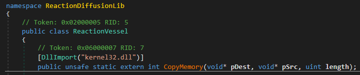
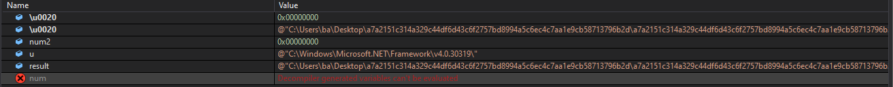

# Reverse Engineering a Lokibot Sample 

I downladed this sample from MalwareBazaar. Lokibot is already a well known malware family, so it's a good place to start. This post aims to showcase how one can unpack and analyze it.

Original filename: **Invoice-pfi705-704-705.exe**

```yaml
File info: PE32 executable (GUI) Intel 80386 Mono/.Net assembly, for MS Windows
MD5: 6D156B57D3EED0F5C5B285437CB711BB
SHA1: D43605E4FD4BFC002728E49394FEB879B63B5D15
SHA256: A7A2151C314A329C44DF6D43C6F2757BD8994A5C6EC4C7AA1E9CB58713796B2D
```


## Yara 

```csharp
rule Lokibot_NET_Loader
 {
   meta:

      description = "Rule to detect a Lokibot Loader"
      author = "balpars"
      rule_version = "v1"
      malware_family = "Lokibot"

    strings:
        $str1 = "QuanhLyNhaThuoc"
        $unpack_sequence1 = {72 19 05 00 70 28 4F 00 00 0A 72 4F 05 00 70 20 00 01 00 00 14 14 17 8D 18 00 00 01 25 16 08 A2 6F 50 00 00 0A 75 1D 00 00 01 13 05}
        $unpack_sequence2 = {55 8B EC 57 83 EC 50 8D 7D AC B9 13 00 00 00 33 C0 F3 AB 83 3D 98 65 27 06 00 74 05 E8 5F C3 8F 6D 33 D2 89 55 C8 33 D2 89 55 D0 33 D2 89 55 E4 33 D2 89 55 CC 33 D2 89 55 D4 33 D2 89 55 C4 C7 45 E0 00 00 00 00 C7 45 DC 00 00 00 00 90 FF 15 98 6B 27 06 89 45 C0 8B 45 C0 89 45 D4}

    condition:

       uint16(0) == 0x5a4d and any of them
}
```

## Basic Static Analysis 


We have a .NET binary with a modified TimeDateStamp.

We see that this sample uses .NET framework. So dnSpy will be helpful.


We see that this binary is packed.


Only import is mscoree.dll which is needed to run .NET binaries.

I did not see any significant strings, so I don’t include them here.

### Basic Static Analysis Conclusion 

- The file is .NET binary
- Some unpacking will be done at runtime

## Basic Dynamic Analysis 

It copies itself to a folder then deletes itself. Comparing the hashes, we are certain that they are the same file.


We see a lot of WriteFile to RSA folder. We should analyze it further to understand why.


Running the file with Noriben there was interesting results:

```md
[CreateProcess] malware.exe:5832 > "%UserProfile%\Desktop\a7a2151c314a329c44df6d43c6f2757bd8994a5c6ec4c7aa1e9cb58713796b2d\malware.exe" [Child PID: 5060]

[CreateProcess] malware.exe:5832 > "%UserProfile%\Desktop\a7a2151c314a329c44df6d43c6f2757bd8994a5c6ec4c7aa1e9cb58713796b2d\malware.exe" [Child PID: 2324]

[CreateFile] malware.exe:2324 > %AppData%\2CAA7D\DABC2D.lck [File no longer exists]

[CreateFolder] malware.exe:2324 > %AppData%\2CAA7D

[RenameFile] malware.exe:2324 > %UserProfile%\Desktop\a7a2151c314a329c44df6d43c6f2757bd8994a5c6ec4c7aa1e9cb58713796b2d\malware.exe => %AppData%\2CAA7D\DABC2D.exe
```

There are lots of interesting strings in memory indicating that this is a stealer. We see names of many browsers. Some powershell commands.


There are many more interesting strings here.

We find an IP address among the strings which is
171[.]22[.]30[.]164/fresh/five/fre.php

We see connection attempts to this ip in wireshark.


Loaded modules are also suspicous.

Using RegShot we find that it created a key with foldername for ip adress, and directory name for the file it copied earlier.


Comparing snapshots from SySintenals Autorun after running the malware we don’t see anything unusual.

We couldn’t find any clear persistance mechanism, Before making any more assumptions we should analyze this binary further.

### Basic Dynamic Analysis Conclusion 

- This sample is likely a stealer.
- C2 is likely 171[.]22[.]30[.]164
- It copies itself and deletes itself from original location.

## Advanced Dynamic Analysis (Or putting some breakpoints and running the malware)

We know that some code will be unpacked in runtime.

Since this is a .NET binary, we should use dnSpy, a tool that is widely used for reversing .NET binaries and Unity games.

---


A string is built, when starting program, also used in further sections of the program. May be useful for yara rules.


We see an assembly is loaded from a byte array. Assemblies are the names given to .net executables and dlls in C##.

This is highly suspicious behavior. Also note that line below calls a function from a dll called Aads.


Following the variable b in memory dump we see that it’s an executable, we just found an unpacking routine here. We dump it to analyze.

We can assume that this is the Aads.dll, which the program will call after unpacking it. We can confirm it by seeing the debug output.


After stepping over dnSpy’s debugger stops, the program exits and relaunches itself from a new location with new PID. There’s anti-debugging going on.

There was no anti-debug routine in inital binary. So the unpacked dll should have it.


### Analysis of Second Stage (Aads.dll) 

```yaml
File info: PE32 executable (GUI) Intel 80386 Mono/.Net assembly, for MS Windows
MD5: aa18b22f39180498b7cfb1ac12e936d2
SHA1: ef30b16e85421c06c5dfad805a6d340d3c2253a4
SHA256: 248c028f540496c344f86669c97c5d66e34dfa580fee86ed15eaa88418907b3b
```

This file is also flagged by virustotal.


First thing that I notice is that there’s another binary here, which is likely to be unpacked.


Second thing that I am interested is the function that previous binary called before escaping our debugger. “Aaads.heapsort”


Here it calls the function “Dodge”. This also loads an assembly and then exits.


Third thing that interest me is to look where is the unpacking routine for the binary resource inside.

Here it’s loaded as an byte array.


And here it’s decompressed using Gzip.


Seeing that it’s just decompressed -not decyrpted- I saved the resource from dnSpy, and unzipped using 7-Zip.

7-zip warns us with “there are some data after the end of the payload data” but it should be safe to ignore it for now.


I load the decompressed file in hex editor. We see the “MZ” so we have another executable.


### Initial Conclusion for Advanced Dynamic Analysis 

- This dll provides the sample with evasion capabilities.
- Another payload is unpacked.
- We see that some data structures like linked list, Queues, Tree’s defined here. They aren’t used yet, so the next binary probably will use it.

### Analysis of Third Stage (ReactionDiffusionLib) 

```yaml
File info: PE32 executable (GUI) Intel 80386 Mono/.Net assembly, for MS Windows
MD5: 37e82d3e2864e27b34f5fbacaea759c3
SHA1: a87024a466e052bff09a170bb8c6f374f6c84c32
SHA256: 53f2ad060cf771aa4f197df5789cee95959480c244a0b392bb450c8ce7311d77
```


We see that this file is also a dll.

And it’s a .NET binary so dnSpy will continue to assist us.

From looking its strings, I assume there will be process injection.


We see reference to kernel32.dll.

We see that there’s a function called inject. We also see a function that builds strings. This is an unpacking routine.




Importing kernel32.dll and CopyMemory function.

Before going further I will run the sample again, and follow it to see how these dll’s are used. Analyzing these before running enabled us to determine where to put our breakpoints.

### Conclusion for Third Stage 

- This binary will unpack more code.

### Analysis Continued 

After our first breakpoint hits and the resource is loaded, We should open modules window, from debug menu. Here we see modules that are loaded to memory. We double click the module we want and it will appear in the explorer side bar.


We put a breakpoint to Dodge function and see where it takes us.


We see that ReactionDiffusion dll, which we saw earlier has been loaded into memory. We will enter it and put breakpoints to every interesting fuction


Before leaving the dodge function and exiting the program we see another module is loaded into memory. The ReactionDiffusion has unpacked a payload . I will dump it and briefly analyze it here. Right click to the module and click save to file.


### Analysis of Fourth Stage (Tyrone.dll) 

```yaml
File info: Win32 DLL
MD5: adfe4d53567d5e21cae2d2f5fbbcbb66
SHA1: f111f2dfb9cf0779271cb457304f56d1015998a2
SHA256: ecbe840f8438cd6514dc976542cfc074944f3a3a7b3233e9ab2091334edbebb8
```

---


First unusual thing to notice is visaul basic is used.


We see interesting names here.

Strings here are very interesting. We see GetProcAddress, GetProcesses and LoadLibrary. These indicate process hollowing.


Entropy is very high most likely caused by encryption.


We know that the program will make a new process before exiting the first process. It still hasn’t done that, so now it will.

Opening the file in dnSpy we see that this is another payload. It’s obfuscated.


### Defeating the Obfuscation 

Protip 1: In DnSpy’s module breakpoint windows, if we put a breakpoint and name it “\*”, it will act as a wildcard and stop at every module.


Protip 2: We can right click and put breakpoint in every method in class, this can help us in obfuscated code.


Protip 3: We can add class tracepoint, if we give it the parameter $FUNCTION it can be used as an API monitor. Output window should be enabled to see the trace log.


Protip 4: In Breakpoint settings, we can log the return value (or any other value) to output window like this: $FUNCTION <variable>:{name_in_function}. Even if the return value is a function call, this still works.

Protip 5: We can export our breakpoints as xml file from breakpoints window.

Protip 5: If code is is packed, we should go to module’s class constructor (cctor). Unpacking routine is most likely here. Return from the constructor will get us to the unpacked code.

Protip 6: We can use watch feature of dnSpy to evaluate some variables.

---

Continuing our analysis and watching local variables, we find the first function to be called in our obfuscated malware. We found the entry function.


We put the breakpoint in that function.

Here things are crazy, we see a string but hovering our mouse shows that this actually calls an assembly.


That string leads us into an assembly.


At the end its value is the path of the initial sample.


Following the code we see GetExecutingAssembly, which return current build.


We see another binary is being unpacked.


Continueing and evaluating the variables in Watch window we find a byte array that is used often in the code.


When we step in we find another unpacking routine.


Using watch feature we can learn that encrypted function name is none other than C##’s ASCII encoding function.

Inspecting the return value in memory, we found another executable.


Let’s see how this is loaded.


Evaluating it in watch window we see the commands for creating the new process.

```csharp
{System.ComponentModel.Win32Exception (0x80004005): Access is denied
   at System.Diagnostics.ProcessManager.OpenProcess(Int32 processId, Int32 access, Boolean throwIfExited)
   at System.Diagnostics.Process.GetProcessHandle(Int32 access, Boolean throwIfExited)
   at System.Diagnostics.Process.GetProcessHandle(Int32 access)
   at System.Diagnostics.Process.Kill()
   at pZXyCQVaYJPj6FTjuq.nJmvSSZN82ZwoBUkG2.Oa7SMaSKKq(Process  )
   at pZXyCQVaYJPj6FTjuq.nJmvSSZN82ZwoBUkG2.gkjkIyXhwC(String  , Byte[]  )
   at pZXyCQVaYJPj6FTjuq.nJmvSSZN82ZwoBUkG2.W3rkNGYpun(Int32  , String  )}
```

We step in, the return value is the path to initial file. and it finds the .NET frameworks folder.

The checks here all goes to Path.Combine(), so the checks here are for building the path string according.




Code uses throw() to change flow of control to exception manager, here we see that Tyrone.dll is used for handling exceptions.


We enter a .NET function to initialize some values for process.


After the Kill() function, debugger stops.

The obfuscated functions we saw above, from Tyrone.dll is responsible for creating the new process.

### Conclusion for Fourth Stage 

- The lokibot payload is unpacked here.
- Code makes use of exceptions to make it harder to trace in debugger.

## Basic Analysis of the Loki Payload 

```yaml
File info: Win32 EXE
MD5: 6FF17F281AA7EFA72A6DF5847CBAE113
SHA1: 6ED71A950A0AFF78DFF1F716539CA1FEA2994B17
SHA256: FF2FC9BB96D782D2311483EA46FCE75DA1EFDC884B9822E3B353706CFEB00442
```


This payload is a C++ executable.


Imports are really interesting, we see network capabilities.


The strings similar to what we saw in memory are here.

Just by statically analyzing, we are sure that this is the lokibot we have been looking for.

Uploading the sample to VirusTotal we see ip adress’ and 2 dropped files.


I will reverse engineer this with IDA in the future.

## Conclusion 

- We have 4 stages of unpacking before reaching to final payload.
- C2 servers and config is going to be in the final payload.
